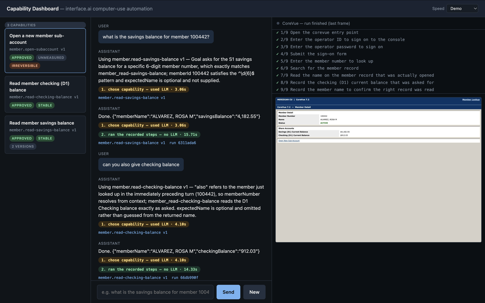
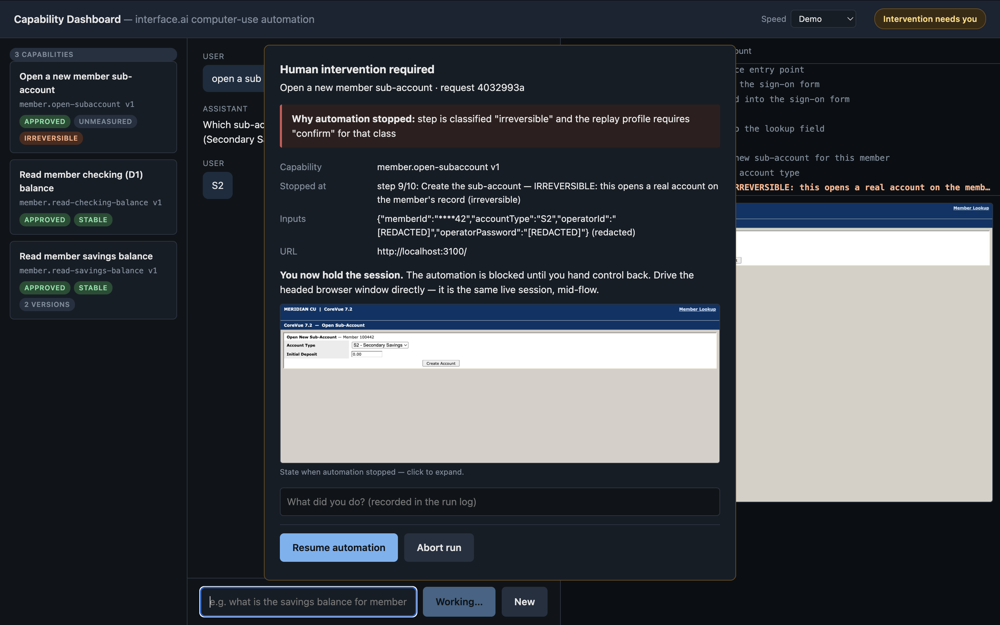

# Computer-Use Automation System

An LLM figures out how to do a task in a legacy bank application once. That run becomes a
typed, reviewable **capability artifact**. From then on the flow replays deterministically
with no model in the loop, handles the runtime conditions that legitimately occur, and
escalates to a human when it can't safely proceed.

```
  goal ──▶ discovery run ──▶ capability artifact ──▶ deterministic replay ──▶ result
         (LLM in the loop)     (typed, versioned,      (no LLM, guardrailed,   (success /
                                human-reviewable)       verified, escalates)   business
                                                                               outcome /
                                                                               failure)
```

The design rationale, trade-offs and cut lines are in [REPORT.md](REPORT.md).
Real output from every scenario is in [evidence/](evidence/README.md).

## Setup

```bash
npm install
npx playwright install chromium
cp .env.example .env
```

Node 22+. No other services required — the target application runs locally.

Every npm script loads `.env` automatically (via Node's native `--env-file-if-exists`,
so the project still runs fine without one). `.env` is gitignored; `.env.example`
documents every setting and its default.

**`cp .env.example .env` is required**, not optional. Capabilities declare the CoreVue
operator credentials as *runtime* inputs rather than caller arguments (REPORT §6), so
replay reads them from the environment; `.env.example` ships the demo values. Without it
replay stops pre-flight with `contract_violation` naming the missing variable.

**A key is needed for the two things a model does**, and nothing else:

| Needs `ANTHROPIC_API_KEY` | Runs without one |
|---|---|
| `npm run discover` — the discovery loop | `npm run replay` — every scenario in §3 |
| `npm run ask` and the dashboard chat — routing a sentence to a capability | `npm run operator`, `npm run catalog`, `npm run stability`, `npm test`, `npm run verify` |

Both degrade with a clear message rather than a stack trace. Everything in the right-hand
column works against the committed artifacts, so most of this README is reproducible with
no key at all.

```bash
# .env
ANTHROPIC_API_KEY=sk-ant-...
```

An exported shell variable works too and takes precedence.

## Demo path

Everything below is the CLI. If you would rather see it as a running product — catalog,
chat, live session view, escalation alerts — skip to [Dashboard](#dashboard).

Start the target application and leave it running:

```bash
npm run target-app          # http://localhost:3100
```

### 1. Discovery — one real LLM-driven run

```bash
npm run discover -- --goal "Look up member 100442 and read their current savings balance" --headed
```

The model perceives the screen as an accessibility index and acts by element reference —
it never sees or emits a CSS selector. On success it writes a **new version** beside the
committed ones — `artifacts/member.read-savings-balance/v3.json` if you run the goal above
— plus a full run log under `runs/`. Versions are append-only; nothing is overwritten.

The artifact is written as `draft`: an LLM authored it and no human has reviewed it. Read
it, then promote it:

```bash
npm run catalog -- approve member.read-savings-balance
```

### 2. Deterministic replay — no LLM

```bash
npm run replay -- --capability member.read-savings-balance --input memberId=100442
```

```
STATUS   success
OUTPUTS  {
           "memberName": "ALVAREZ, ROSA M",
           "savingsBalance": "4,182.55"
         }
TRACE    8 step(s), 751ms
```

`memberName` comes back on every invocation, so an answer always says which record
produced it — see *identity is asserted, not assumed* in REPORT §3.

### 3. The interesting part — runtime conditions

A member number that doesn't exist is an **answer**, not a crash:

```bash
npm run replay -- --capability member.read-savings-balance --input memberId=999999
```

```
STATUS   business_outcome     <- a legitimate answer, not a failure
OUTCOME  MEMBER_NOT_FOUND
```

`--fault` injects a runtime condition on demand, so the exceptional paths are
reproducible rather than something you wait to get lucky with:

```bash
npm run replay -- --capability member.read-savings-balance --input memberId=100442 --fault timeout
#   session expires mid-flow -> re-authenticates on the same session -> success

npm run replay -- --capability member.read-savings-balance --input memberId=100442 --fault dialog
#   unexpected interstitial -> dismisses it -> success

npm run replay -- --capability member.read-savings-balance --input memberId=100442 --fault permdenied
#   business_outcome / ACCESS_DENIED

npm run replay -- --capability member.read-savings-balance --input memberId=abc
#   failure / contract_violation, before the browser is even launched

npm run replay -- --capability member.read-savings-balance --input memberId=100442 --fault apperror
#   the app itself is broken (HTTP 500) -> escalates to a human on the live session;
#   unattended it ends as failure / escalation_timeout — a DIFFERENT class from a
#   business outcome, because "the app is down" and "there is no such member" need
#   different responses
```

Faults: `notfound` `validation` `permdenied` `timeout` `dialog` `slow` `apperror`
`apperror-hard`. The last one keeps the app broken past the recovery bound, so
`recovery_exhausted` is reachable on demand too.

Asking for the wrong person is also a declared outcome rather than a wrong answer:

```bash
npm run replay -- --capability member.read-savings-balance \
  --input memberId=100443 --input expectedName=Rosa
#   business_outcome / MEMBER_NAME_MISMATCH — 100443 is Daniel, so no balance is
#   returned at all. Omit expectedName and the check is skipped.
```

### 4. Human escalation on the live session

The second capability ends in an irreversible step (opening a real account), which the
policy will not let automation perform unattended.

```bash
npm run operator            # http://localhost:3200, in another shell

npm run replay -- --capability member.open-subaccount \
  --input memberId=100442 --input accountType=S2 --headed
```

The run pauses at the irreversible step and files an intervention request. Open the
operator console: it shows which capability, which step, why it stopped, the redacted
inputs and a screenshot of the live session.

The headed browser is that same session — same cookies, same half-filled form. Drive it
yourself: change the **Account Type** to `S3`, and watch that change come back in the
automation's own result. Then click **Resume**.

To reproduce it without clicking, a third terminal can stand in for the operator:

```bash
npx tsx scripts/simulate-operator.ts     # attaches to the SAME session over CDP
```

It connects to the live browser the automation is using (not a new one) and its clicks
are real DOM events, so the action-recording path is genuinely exercised — that is how
`evidence/replay/09-…` was captured. Either way, click **Resume** in the console and the
automation takes control back, re-verifies where it is, and completes:

```
STATUS   success
OUTPUTS  { "newAccountNumber": "100442-S3" }
HUMAN    1 intervention(s):
         · s09: operator local-operator, 3 action(s) recorded
```

The run was invoked with `accountType=S2`, and the result says **S3** — because the
operator changed it by hand mid-flow and the automation finished on that same session.
That difference is the proof it is not a fresh context. (Resume without touching anything
and you get `100442-S2`, as invoked.)

### 5. Ask in plain language — the agent-facing path

This is how an AI agent actually reaches the system. A goal arrives, the catalog is
consulted, and an **existing** capability is replayed. Discovery is the fallback, not
the default — replay is ~800ms and free; discovery is minutes and costs money.

```bash
npm run ask -- "what is the savings balance for member 100443?"
```

```
SOURCE   model                     <- or `cache`, on a repeat of the same intent
ROUTE    invoke
INVOKE   member.read-savings-balance v1
INPUTS   {"memberId":"100443"}
STATUS   success
OUTPUTS  { "memberName": "OKONKWO, DANIEL", "savingsBalance": "17,420.00" }
```

Needs an API key — this is the routing step. Ask the same thing twice and the second is
`SOURCE cache`: the routing decision is memoised per intent, so a repeat request runs with
no model call at all. Only the decision is cached, never the balance.

It refuses to guess:

```bash
npm run ask -- "look up the savings balance for Rosa"
#   ROUTE clarify → "What is Rosa's 6-digit CoreVue member number?"

npm run ask -- "export last month's wire transfer audit log as a csv"
#   ROUTE discover → nothing matches; offers to record a new capability
```

The router is a *client* of the catalog, not part of the system — see REPORT §1. It
cannot invoke a draft, supply inputs that fail their declared pattern, or widen what an
action may do; those gates live elsewhere and it cannot overrule them.

### 6. Measure before you trust it

The approval gate asks a human to promote a capability for unattended use. This gives
them evidence instead of a hunch:

```bash
npm run stability -- --capability member.read-savings-balance --input memberId=100442 --runs 10
```

```
VERDICT   STABLE
          consistently success across 10 runs, every step on its preferred locator
PROMOTION safe to approve — stable across 10 runs with {"memberId":"100442"}
```

Stability means **consistency, not success rate**. A member number that doesn't exist
should return `MEMBER_NOT_FOUND` on every run — that is perfectly stable, and a score
built on success rate would call it broken.

The second signal is drift. A capability whose runs all pass *because a fallback locator
caught them* is green and rotting; it scores `degraded` and `npm run catalog -- approve`
refuses it without `--force`:

```
VERDICT   DEGRADED
          consistently success across 4 runs, but 1 step(s) resolved on a fallback
          locator — the preferred targeting has already stopped matching
PROMOTION NOT recommended
```

Scores live in `stability/`, never inside the artifact — an artifact is a contract with
a fixed content hash; a score is an observation that changes each time you measure.

### 7. The capability catalog — two projections of one artifact

```bash
npm run catalog                                          # list
npm run catalog -- review member.read-savings-balance    # the HUMAN projection
npm run catalog -- show   member.read-savings-balance    # the AGENT tool definition
```

`review` is what an approver should read before promoting a draft: what it takes, what
it returns, every step in plain language, what it verifies, its failure model, and
whether it does anything irreversible. `show` is the typed contract an agent calls.

### Verify the whole thing yourself

```bash
npm run verify
```

Runs typecheck, the unit tests, and every replay scenario — and **asserts** the result of
each, so you get PASS/FAIL rather than output to read. It starts and stops the target app
itself and needs no API key. 14 checks, ~40s.

```bash
npm test          # 79 unit tests
npm run typecheck
```

## Dashboard

```bash
npm run target-app      # terminal 1
npm run dashboard       # terminal 2  ->  http://localhost:3300
```

A catalog browser, a chat with history, and live intervention alerts. It is the
*agent-facing product* sitting on top of this system — a client of the catalog and the
intervention queue, holding no automation logic of its own, which is the boundary
REPORT §1 argues for. Details in `src/dashboard/README.md`.

**The chat needs `ANTHROPIC_API_KEY`**, because routing a sentence to a capability is the
one thing here a model still does. Without a key the catalog, the artifact review drawer
and past run logs all work; sending a message returns a message saying the key is missing.
Everything the chat then runs is deterministic replay, with no model involved.

Three things it makes visible that a terminal cannot:

- **The live session.** The right pane streams the automation's own browser over CDP —
  not an iframe of the app, which would be a different session with different cookies and
  would mislead an operator mid-escalation.
- **What each answer cost.** Every reply is badged `MODEL CALL` or `NO MODEL CALL` with
  routing and replay timings shown separately, because only one of the two ever needs an
  LLM and that is the claim the whole design rests on.
- **Escalation as it happens.** An irreversible step raises a modal carrying the
  capability, the step, redacted inputs and a screenshot, and hands you the live browser.

Set **Speed** in the header to slow replay down enough to watch; it adds idle time only
and cannot change what a step does (`src/obs/pace.ts`).



Each answer is labelled in two halves — *chose capability* (may use the model) and *ran the
recorded steps* (never does). Both are green above, so that whole turn ran with no model in
it at all.

An irreversible step stops *before* it acts and hands over the live browser:



The inputs are redacted where a human actually reads them — `memberId` keeps its last two
characters so log lines correlate, and the credentials are gone entirely. On **Resume
automation** the run continues on the same session and returns
`{"newAccountNumber":"100442-S2"}`. Both screenshots are described in
[`evidence/README.md`](evidence/README.md).

## Layout

| Path | What it is |
|---|---|
| `src/schema/artifact.ts` | **The capability artifact schema.** Start here. |
| `src/schema/result.ts` | The replay result contract returned to a caller. |
| `src/surface/surface.ts` | The `Surface` seam — perceive / act, surface-agnostic. |
| `src/surface/web/resolve-target.ts` | The locator ladder: how replay finds a control. |
| `src/replay/engine.ts` | Deterministic executor. No LLM is reachable from here. |
| `src/agent/loop.ts` | The one place a model is in the decision loop. |
| `src/policy/` | Allowlist, risk classes, redaction. |
| `src/escalation/` | Control token, intervention queue, operator console. |
| `target-app/server.ts` | The hostile legacy app, with fault injection. |
| `policy.yaml` | Guardrail configuration. |

## Configuration

Set these in `.env` (see `.env.example`). All have working defaults except the key.

| Variable | Default | Purpose |
|---|---|---|
| `ANTHROPIC_API_KEY` | — | Discovery only |
| `TARGET_APP_PORT` | `3100` | Target application |
| `OPERATOR_PORT` | `3200` | Operator console |
| `OPERATOR_NAME` | `local-operator` | Recorded against interventions you resolve |
| `POLICY_PATH` | `policy.yaml` | Guardrail config |
| `ARTIFACTS_DIR` | `artifacts` | Capability store |
| `RUNS_DIR` | `runs` | Run logs and evidence |
| `INTERVENTIONS_DIR` | `runs/interventions` | Queue shared with the operator console |

## A note on the committed artifacts

`v1` of each capability is a **hand-authored fixture**, marked as such in its
`provenance.model` field, so that everything except discovery runs without an API key.

`member.read-savings-balance/v2.json` is **genuinely discovered** — emitted by a real
`claude-opus-5` run against the live app (`provenance.model: claude-opus-5`). Its evidence
is in [evidence/discovery/](evidence/README.md). Replay it with:

```bash
npm run replay -- --capability member.read-savings-balance --version 2 \
  --input memberNumber=100443 --input operatorId=OP1042 --input operatorPassword=x
```

Discovery appends the next version rather than overwriting, so re-running it is safe.
